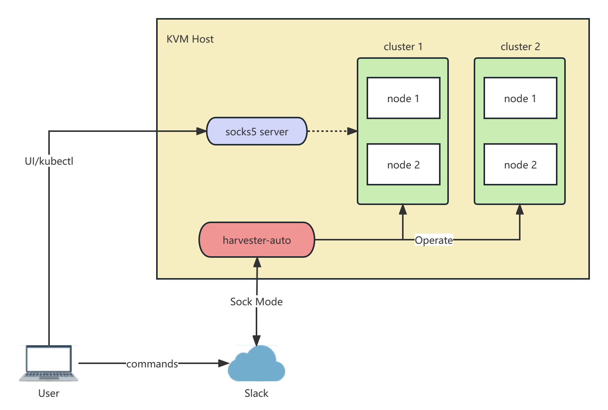

# harvester-auto

Create a Harvester Cluster with a single slack command.

## Features

- [x] Multi-Repo
- [x] Multi-Branch
- [x] Multi-User
- [x] Multi-Cluster
- [x] Multi-Node-Per-Cluster
- [x] Multi-Disk-Per-Node
- [x] Multi-NIC-Per-Node
- [x] Auto-Download-Release
- [x] Auto-Build-ISO
- [x] Auto-Deploy-Cluster
- [x] Auto-Init-Cluster
- [x] Auto-Build-Push-UI
- [x] Auto-Build-Push-Patch-Image
- [x] Auto-Notification

## Architecture



## Environment

### Ubuntu

#### Vagrant Libvirt

```bash
sudo apt purge vagrant-libvirt
sudo apt-mark hold vagrant-libvirt
sudo apt update
sudo apt install -y qemu libvirt-daemon-system ebtables libguestfs-tools vagrant ruby-fog-libvirt
```

#### Docker

```bash
curl -sL https://releases.rancher.com/install-docker/20.10.sh | bash -
sudo systemctl enable --now docker
```

#### Proxy

Since the Harvester nodes created use a private network, all are only accessible on the host node. In order to access
the Harvester UI remotely and use kubectl to manage the cluster, running a socks5 proxy server on the host

```bash
# refer to https://github.com/serjs/socks5-server
sudo docker run -d --name socks5 --restart=unless-stopped -p 1080:1080 serjs/go-socks5-proxy
```

#### Nginx

Use nginx to serve the built ISO, you can also use it to serve cloud images or other stuffs, just put your files
under `/var/www/html`.

```bash
sudo apt install -y nginx
sudo systemctl enable --now nginx
```

#### Harbor

- Refer to the documentation https://goharbor.io/ to install Harbor
- create a `rancher` project
- docker login

```bash
docker login <Harbor domain>
```

#### Dnsmasq

- Refer to the documentation https://computingforgeeks.com/install-and-configure-dnsmasq-on-ubuntu/ to install dnsmasq

#### Nodejs

- Refer to the documentation https://computingforgeeks.com/install-node-js-14-on-ubuntu-debian-linux/ to install nodejs

#### Tools

```bash
sudo apt install -y ansible sshpass jq
sudo pip install jinja2-cli
sudo snap install yq
# kubectl
curl -LO "https://dl.k8s.io/release/$(curl -L -s https://dl.k8s.io/release/stable.txt)/bin/linux/amd64/kubectl"
chmod +x kubectl
mv kubectl /usr/local/bin/
# helm
curl -fsSL -o get_helm.sh https://raw.githubusercontent.com/helm/helm/main/scripts/get-helm-3
chmod 700 get_helm.sh
./get_helm.sh
# terraform
wget -O- https://apt.releases.hashicorp.com/gpg | gpg --dearmor | sudo tee /usr/share/keyrings/hashicorp-archive-keyring.gpg
echo "deb [signed-by=/usr/share/keyrings/hashicorp-archive-keyring.gpg] https://apt.releases.hashicorp.com $(lsb_release -cs) main" | sudo tee /etc/apt/sources.list.d/hashicorp.list
sudo apt update && sudo apt install terraform
````

## Usage

### Preparing your Slack App

Refer to https://github.com/shomali11/slacker#preparing-your-slack-app

### Clone

```bash
git clone https://github.com/futuretea/harvester-auto.git
cd harvester-auto
```

### Configure

Change the dns nameserver address and image repo configurations in `./commands/_config.sh`

```bash
cd commands
cp _config.sh.example _config.sh
vim _config.sh
cd -
```

Fill in the Slack app token and user configurations in `./configs/config.yaml`

```bash
cd configs
cp config.yaml.example config.yaml
vim config.yaml
cd -
```

You can use the default nginx configuration or use the custom one `configs/nginx.conf` in this repo.

```bash
sudo cp configs/ngxin.conf.example /etc/nginx/nginx.conf
sudo vim /etc/nginx/nginx.conf
sudo nginx -t
sudo systemctl restart nginx
```

### Build

```bash
make
mv ./bin/harvester-auto .
```

### Run for testing

```bash
./harvester-auto
```

### Run in background

```bash
cat > /tmp/harvester-auto.service <<EOF
[Unit]
Description=Harvester Auto Service
After=network.target

[Service]
Type=simple
User=${USER}
Restart=on-failure
RestartSec=5s
ExecStart=${PWD}/harvester-auto
WorkingDirectory=${PWD}

[Install]
WantedBy=multi-user.target
EOF
sudo cp /tmp/harvester-auto.service /etc/systemd/system/
sudo systemctl daemon-reload
sudo systemctl enable --now harvester-auto
```

### Update

```bash
git pull
make
sudo systemctl stop harvester-auto
mv ./bin/harvester-auto .
sudo systemctl start harvester-auto
```

### Send commands from slack

Send `help` to the Slack app to get the help message

#### Commands

- help - help

- ping - Ping! `*`
  > Example: ping

- history `historyNumber` - Show history `*`
  > Example: history

  > Example: history 100

- l - List Harvester clusters `*`
  > Example: l

- c `clusterID` - Show/Set Current Harvester cluster `*`
  > Example: c (show current cluster id)

  > Example: c 1 (set current cluster id to 1)

- status - Show Harvester cluster status `*`
  > Example: status

- url - Show Harvester cluster URLs `*`
  > Example: url

- version - Show Harvester version `*`
  > Example: version

- name `name` - Show/Set Harvester name `*`
  > Example: name

  > Example: name test-cluster

- settings - Show Harvester settings `*`
  > Example: settings

- pis `kubeNamespace` - Show Pod Images `*`
  > Example: pis

  > Example: pis cattle-system

- pods  `kubeNamespace` - Show Pods `*`
  > Example: pods

  > Example: pods cattle-system

- vms  `kubeNamespace` - Show VMs `*`
  > Example: vms

  > Example: vms harvester-public

- settings - Show Harvester settings `*`
  > Example: settings

- kubeconfig - Show Harvester cluster kubeconfig content `*`
  > Example: kubeconfig

- sshconfig - Show ssh config for connecting `*`
  > Example: sshconfig

- destroy - Destroy Harvester cluster nodes `*`
  > Example: destroy

- virsh `command` `args` - virsh command warpper `*`
  > Example: virsh list

- ps - Show running jobs `*`
  > Example: ps

- log `job` `lineNumber` - Tail Job logs `*`
  > Example: log 2c

  > Example: log 2c 100

  > Example: log 2ui

  > Example: log 2ui 100

  > Example: log 2pt

  > Example: log 2pt 100

  > Example: log sc

  > Example: log sc 100

- kill `job` - Kill running job `*`
  > Example: kill 2c

  > Example: kill 2pt

  > Example: kill 2ui

  > Example: kill sc

- pr2c `harvesterPRs` `harvesterInstallerPRs` `harvesterConfigURL` - Create a Harvester cluster after merging PRs or
  checkout branches, always build ISO `*`
  > Example: pr2c 0 0

- pr2cNoBuild `harvesterPRs` `harvesterInstallerPRs` `harvesterConfigURL` - Create a Harvester cluster based on PRs or
  branches, but use the built ISO from pr2c `*`
  > Example: pr2cNoBuild 0 0

- v2c `harvesterVersion` `harvesterConfigURL` - Create a Harvester cluster after downloading the ISO *
  > Example: v2c v1.1.1

- scale `nodeNumber` - Scale Harvester nodes *
  > Example: scale 2

- pr2ui `uiPRs` - Build Harvester Dashboard `*`
  > Example: pr2ui 0

- pr2pt `repoName` `repoPRs` - Patch Harvester image after merging PRs or checkout branches, always build image `*`
  > Example: pr2pt harvester 0

`* Authorized users only`