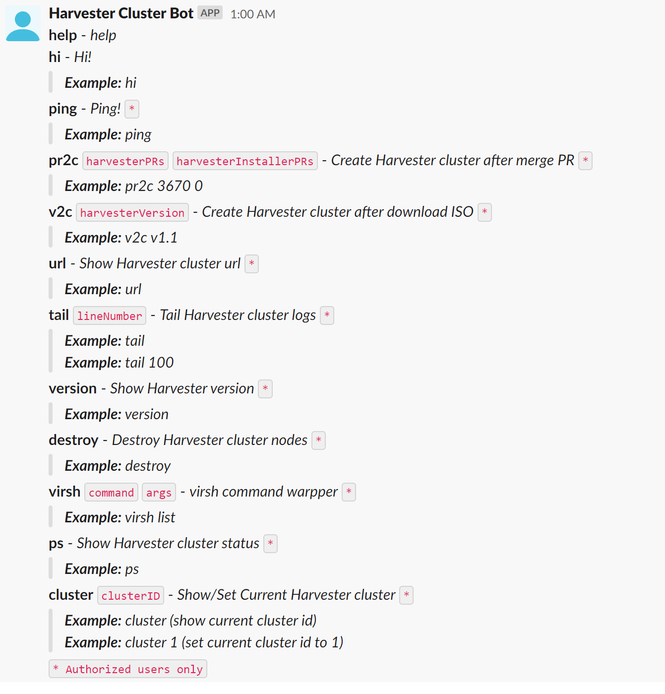

# harvester-auto

Bootstrap a Harvester Cluster with a single slack command.

## Features

- [x] Multi-User
- [x] Multi-Cluster
  - [x] Multi-Node-Per-Cluster
    - [x] Multi-Disk-Per-Node
    - [x] Multi-NIC-Per-Node
- [x] Auto-Download-Release
- [x] Auto-Build-ISO
    - [x] Multi-Repo
    - [x] Multi-Branch
- [x] Auto-Deploy
- [ ] Auto-Notification
- [ ] Auto-Patch-Image
- [ ] Auto-Power-Management


## Environment Requirements

### Ubuntu

#### vagrant-libvirt
```bash
sudo apt purge vagrant-libvirt
sudo apt-mark hold vagrant-libvirt
sudo apt update
sudo apt install -y qemu libvirt-daemon-system ebtables libguestfs-tools vagrant ruby-fog-libvirt
```

#### docker
```bash
curl -sL https://releases.rancher.com/install-docker/20.10.sh | bash -
sudo systemctl enable --now docker
```

#### nginx
```bash
sudo apt install -y nginx
sudo systemctl enable --now nginx
```
You can use the default nginx configuration or use the custom one `configs/nginx.conf`

#### Proxy
Since the Harvester nodes created use a private network, all are only accessible on the host node. In order to access the Harvester UI remotely and use kubectl to manage the cluster, running a socks5 proxy server on the host
```bash
# refer to https://github.com/serjs/socks5-server
sudo docker run -d --name socks5 --restart=unless-stopped -p 1080:1080 serjs/go-socks5-proxy
```

#### tools
```bash
sudo apt install -y ansible sshpass
sudo pip install jinja2-cli
sudo snap install yq
````

#### Harbor (Optional)
- Refer to the documentation https://goharbor.io/ to install Harbor
- create a `rancher` project

## Usage example

### Preparing your Slack App

Refer to https://github.com/shomali11/slacker#preparing-your-slack-app

### Docker Login

#### Option 1: Harbor
```bash
docker login <Harbor domain/ip:port>
```
Adjust the `default_image_repo` in the `./scripts/_config.sh` to `<Harbor domain/ip:port>/rancher`

#### Option 2: Docker Hub
```bash
docker login
```
Adjust the `default_image_repo` in the `./scripts/_config.sh` to `<dockerhub username>`

### Build
```bash
git clone https://github.com/futuretea/harvester-auto.git
cd harvester-auto
make
mv ./bin/harvester-auto .
```

### Configuration
```bash
cd configs
cp config.yaml.example config.yaml
vim config.yaml
cd -
```

### Run for testing
```bash
./harvester-auto
```

### Run in background
```bash
sudo cp configs/harvester-auto.service /etc/systemd/system/
vim /etc/systemd/system/harvester-auto.service
sudo systemctl daemon-reload
sudo systemctl enable --now harvester-auto
```

### Update
```bash
make
sudo systemctl stop harvester-auto
mv ./bin/harvester-auto .
sudo systemctl start harvester-auto
```

### Send commands from slack

Send `help` to the Slack app to get the help message

